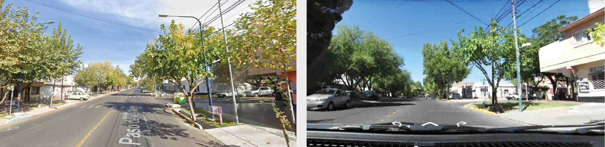

# Awesome SVI

  

A curated repository of Awesome Street View Imagery (SVI) resources including datasets, providers, tutorials, papers and other resources.

[ *Under construction 06/2024* ]

**Table of Contents**

- [Datasets](#Datasets)
- [Building your own SVI Datasets](#Building-your-own-SVI-Datasets)
- [SVI Providers](#SVI-Providers)
- [SVI Review Papers](#Review-papers)

----

## Datasets

| Dataset | Task/Problem | Spatial Coverage | Geolocated? |
| --- | --- | ---- | ---|
| [PlacePulse 2.0](#place-pulse-20) | Urban Perception | 56 cities around the world | Yes |
| [Visual Soundscapes](#visual-soundscapes) | Acoustic Characteristics Prediction | Singapur, Shenzhen | No |
| [CityScapes](#cityscapes) | Semantic Segmentation | 50 German cities | No
| [Treepedia](#treepedia) | Tree Coverage Segmentation | Cambridge, Jonahhesburg, Oslo, Sao Paulo, Singapore | No
| [SustainBench](#SustainBench) | Socio-urban development | 56 Countries | At neighborhood level
| [Resource Cadastre](#Resource-Cadastre) | Facade Material Classification | NY, Tokyo, Zurich | No
| [Street Scouting](#Street-Scouting) | Urban Object Detection | Greece | Yes
| [GSV Cities](#GSV-Cities) | Place Recognition/ Geolocalization| Multiple cities around the world | Yes
| [StreetSense](#StreetSense) | Road Quality Evaluation | Lagos, Bangkok, Jakarta, Wayne | Yes
| [OpenStreetView-5M](#OpenStreetView-5M) | Place Recognition/ Geolocalization | 225 countries | Yes

| ▲ [Top](#Awesome-SVI) |

### Place Pulse 2.0

A dataset to evaluate urban perception, which contains crowdsourced impressions of beauty, wealthy, safety, liveliness, boreness and interestingness of more than 100.000 SV images around the world.

[Access the Place Pulse 2.0 Dataset](https://www.dropbox.com/scl/fi/j19aw939mvgz2prdfo722/place-pulse-2.0.zip?rlkey=dpo90zmmi35f26ahejo4mb4m5&e=1&dl=0)

[Other source to access the Dataset](https://drive.google.com/drive/folders/1AhFu9GKDgTERgI7SED_hP801Kt7DwALc)

**Related repositories, code & resources:**

* [Official PlacePulse Repository](https://github.com/CenterForCollectiveLearning/Place-Pulse)

**Papers introducing or using the dataset:**

* [Deep Learning the City: Quantifying Urban Perception at a Global Scale](https://link.springer.com/chapter/10.1007/978-3-319-46448-0_12). Dubey et al. (2016)
* [Are Safer Looking Neighborhoods More Lively?: A Multimodal Investigation into Urban Life.](https://dl.acm.org/doi/10.1145/2964284.2964312) De nadai et al. (2016)
* [Computer vision uncovers predictors of physical urban change.](https://www.pnas.org/doi/full/10.1073/pnas.1619003114) Naik et al. (2017)

| ▲ [Datasets](#Datasets) |

### Visual Soundscapes

A dataset for evaluating the visual perception of urban sound characteristics. Contains crowdsourced perceptions + on-field sound measurements + other derived urban metrics and segmented image content.

[Access the Visual Soundscapes Dataset](https://github.com/ualsg/Visual-soundscapes)

**Papers introducing or using the dataset:**
* [Sensing urban soundscapes from street view imagery](https://www.sciencedirect.com/science/article/abs/pii/S0198971522001594?via%3Dihub). Zhao et al.

| ▲ [Datasets](#Datasets) |

### CityScapes

A urban object-segmentation dataset, containing annotated masks for a wide amount of common urban objects in SVI-like images.

[Access the CityScapes Dataset](https://www.cityscapes-dataset.com/)

**Papers introducing or using the dataset:**
* [The Cityscapes Dataset for Semantic Urban Scene Understanding](https://arxiv.org/abs/1604.01685). Cords et al.

| ▲ [Datasets](#Datasets) |

### Treepedia

Dataset providing tree coverage masks on street view imagery.

[Access the Treepedia Dataset](https://senseable.mit.edu/treepedia-shared/)

**Related repositories, code & resources:**
* [Website showcasting the results of the original project](https://senseable.mit.edu/treepedia/)
* [Treepedia Package Repository](https://github.com/mittrees/Treepedia_Public)
* [Treepedia 2.0 Repository](https://github.com/billcai/treepedia_dl_public?tab=readme-ov-file)

**Papers introducing or using the dataset:**

* [Treepedia 2.0: Applying Deep Learning for Large-scale Quantification of Urban Tree Cover.](https://arxiv.org/abs/1808.04754) Yang Cai et al (2018)
* [Assessing street-level urban greenery using Google Street View and a modified green view index.](https://senseable.mit.edu/treepedia/treepedia_publication.pdf) Li et al (2015)
* [Green streets − Quantifying and mapping urban trees with street-level imagery and computer vision.](https://senseable.mit.edu/papers/pdf/20170512_Seiferling_etal_GreenStreets_LandscapeUrbanPlanning.pdf) Seiferling et al. (2017)
* [Mapping the spatial distribution of shade provision of street trees in Boston using Google Street View panoramas.](https://senseable.mit.edu/papers/pdf/20180425_Li-Ratti_MappingShades_UrbanForestry.pdf) Li & Ratti (2018)

| ▲ [Datasets](#Datasets) |

### SustainBench

A dataset that makes part of the SustainBench project for monitoring sustainable development goals. It provides satellite imagery + SVI of neighborhoods around the world, with annotations for different development indicators (women education, clean water, sanitation, child moratlity rate, women BMI, wealth).

[Access the SustainBench Dataset](https://sustainlab-group.github.io/sustainbench/docs/datasets/dhs.html)

**Papers introducing or using the dataset:**
* [Predicting Livelihood Indicators from Community-Generated Street-Level Imagery](https://ojs.aaai.org/index.php/AAAI/article/view/16101). Lee et al (2021)
* [Using publicly available satellite imagery and deep learning to understand economic well-being in Africa](https://www.nature.com/articles/s41467-020-16185-w). Yeh et al. (2020)

| ▲ [Datasets](#Datasets) |

### Resource Cadastre

A dataset providing SVI labelled with the facade material of the building in the scene.

[Access the Resource Cadastre Dataset](https://github.com/raghudeepika/urban-resource-cadastre-repository/tree/main/data)

**Papers introducing or using the dataset:**
* [Towards a ‘resource cadastre’ for a circular economy – Urban-scale building material detection using street view imagery and computer vision](https://www.sciencedirect.com/science/article/pii/S0921344923002768). Raghu et al. (2023)

| ▲ [Datasets](#Datasets) |

### Street Scouting

A dataset for urban object detection using SVI-like videos. 

[Access the Street Scouting Dataset](https://zenodo.org/records/7564876)

**Papers introducing or using the dataset:**
* [StreetScouting dataset: A Street-Level Image dataset for finetuning and applying custom object detectors for urban feature detection](https://www.sciencedirect.com/science/article/pii/S2352340923001609). Moschos et al. (2023)

| ▲ [Datasets](#Datasets) |

### GSV Cities

Dataset for Visual Place recognition and geolocalization comprising 530k images around spread across different cities.

[Access the GSV Cities Dataset](https://www.kaggle.com/datasets/amaralibey/gsv-cities)

[Dataset Repository](https://github.com/amaralibey/gsv-cities?tab=readme-ov-file)

**Papers introducing or using the dataset:**
* [GSV-Cities: Toward appropriate supervised visual place recognition](https://www.sciencedirect.com/science/article/abs/pii/S0925231222012188)

| ▲ [Datasets](#Datasets) |

### StreetSense

A dataset to assess the condition of roads and sidewalks based on SVI.

[Access the StreetSense Dataset](https://github.com/geosensing/streetsense)

### OpenStreetView-5M

A dataset for geolocalization based on SVI, providing over 5.1 million geolocated SVI of 225 countries around the world.

[Access the OpenStreetView-5M Dataset](https://huggingface.co/datasets/osv5m/osv5m)

**Related repositories, code & resources:**
* [Official Repository](https://github.com/gastruc/osv5m)
* [Dataset Presentation](https://imagine.enpc.fr/~ioannis.siglidis/osv5m/)

**Papers introducing or using the dataset:**
* [OpenStreetView-5M: The Many Roads to Global Visual Geolocation.](https://arxiv.org/abs/2404.18873) Astruc et al. (2024)

| ▲ [Datasets](#Datasets) |

## Building your own SVI Datasets

Some repositories and resources to acces SVI and build your own SVI dataset collecting crowdsourced tags

* [City-wide perceptions of neighbourhood quality using street-view images: a methodological toolkit](https://emilymuller1991.github.io/urban-perceptions/index.html): Provides all the necessary components to launch your own urban perceptions survey using street view images.

* [Human Perception and SVI Project ](https://github.com/Spatial-Data-Science-and-GEO-AI-Lab/percept)

| ▲ [Datasets](#Datasets) |

## SVI Providers

| Provider | Source type | Spatial Coverage | 
| --- | --- | ---- | 
| [Google Street View](https://www.google.com/intl/es/streetview/) | Proprietary | Global
| [Mappillary](https://www.mapillary.com/app/) | Open Source - Crowdsourced | Global
| [Kartaview](https://kartaview.org/map/@2.842170943040401e-14,-69.41898248466964,0z) | Open Source - Crowdsourced | Global
| [Baidu](https://map.baidu.com/) | Proprietary | China
| [Yandex](https://yandex.com/maps/) | Proprietary | Russia, Ukraine, Belarus, Kazakhstan, Armenia, Turkey and Uzbekistan
|[Bing Maps](https://www.bing.com/maps?cp=38.640157%7E42.66195&lvl=2.0) | Proprietary | Canada, US, UK

A full list of other SVI local and regional providers per country can be accessed in this [Wikipedia Site](https://en.wikipedia.org/wiki/List_of_street_view_services#:~:text=Google%20Street%20View%20is%20the,a%20CC%20BY%2DSA%20license.)

| ▲ [Top](#Awesome-SVI) |

## SVI Review Papers
[Street View Imagery (SVI) in the Built Environment: A Theoretical and Systematic Review.](https://www.mdpi.com/2075-5309/12/8/1167) Li et al. (2022)

[Street view imagery in urban analytics and GIS: A review.](https://www.sciencedirect.com/science/article/pii/S0169204621001808) Biljecki & Ito (2021)

[A review of urban physical environment sensing
using street view imagery in public health studies](https://senseable.mit.edu/papers/pdf/20200801_Kang-etal_ReviewUrbanPhysical_AnnalsGIS.pdf). Kang et al (2020)

[Urban neighbourhood environment assessment based on street view image processing: A review of research trends.](https://www.sciencedirect.com/science/article/pii/S266701002100069X) He & Li (2021)

[Understanding urban perception with visual data: A systematic review](https://www.sciencedirect.com/science/article/pii/S0264275124003834?dgcid=coauthor) Ito, K. et al. (2024)

| ▲ [Top](#Awesome-SVI) |
